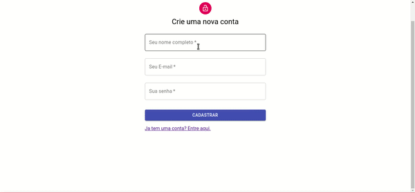

# Desafio processo seletivo Eduzz - Fullstack

O projeto consiste em simular compra e venda de bitcoins pegando como referência a cotação atual disponibilizada pela api do mercado bitcoin.

Para rodar a aplicação é necessário ter o `docker/docker-compose` instalado, bastando apenas lançar o comando `docker-compose up --build` na raiz do projeto e aguardar até que todos os serviços estejam disponíveis. Para usar o aplicativo, acesse o endereço `http://localhost:3000` e cadastre um novo usuário. O GIF abaixo mostra um breve exemplo da aplicação em funcionamento.

Todas as variáveis de ambiente já estão pré-configuradas, porém você pode modificar para os valores de sua preferência, tanto no docker-compose.yml quanto no arquivo .env.test.

Caso tenha interesse em rodar os testes, mantenha a aplicação rodando, abra um novo terminal na raiz então acesse o serviço do backend com o comando `docker-compose exec backend sh`, após ele abrir o bash basta digitar o comando `npm run test` e aguardar até finalizar todos os testes.
